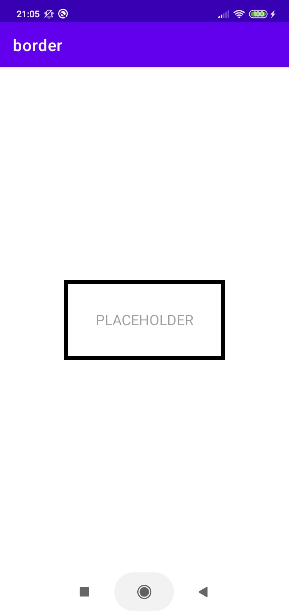
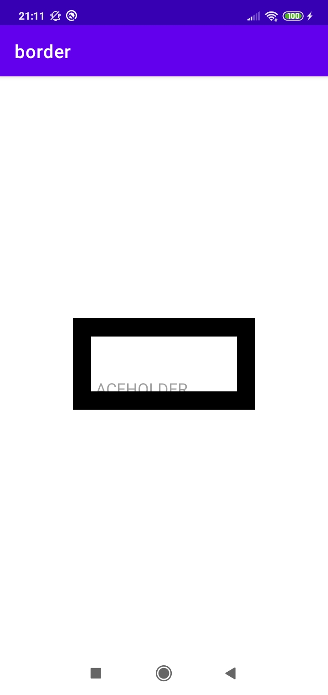
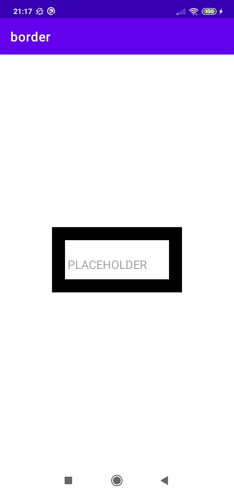

# Border Related Problems

  

> See Code In
https://github.com/yatw/AndroidUIFundamentals/blob/master/border/app/src/main/java/com/example/border/UidlTextView.java

## Problem1

When a class extend from EditText and have the following property:

```java

this.setGravity(Gravity.CENTER);

this.setInputType(InputType.TYPE_CLASS_TEXT);

this.setTypeface(null, Typeface.NORMAL);

```

  

**The border draw from canvas `canvas.drawRect()` do not show**

  

**Caused:**

The canvas is shifted

https://stackoverflow.com/questions/37524507/canvas-drawrect-is-not-work-in-textviews-ondraw-when-set-gravity

  

**Solution:**

Before you draw the canvas, translate the scrolled XY distance

  

```java

canvas.translate(getScrollX(), getScrollY());

canvas.drawRect(0,0, getWidth(), getHeight(), borderPaint);

```

  

### Result

|

  

## Problem2

When the border is thick enough it can block the text within

if `this.setGravity(Gravity.LEFT|Gravity.BOTTOM);`

|

  

**Solution:**

Shift the display text according to border width

If the text is gravity left, then the canvas need to shift right before drawing the text

If the text has gravity right, then the canvas need to shift left before drawing the text

  

### Result

|
