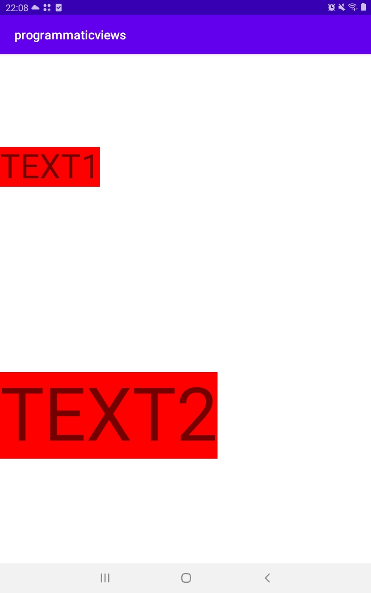

# Creating Views Programmatically
  
This project have one constraint layout that contain 2 textViews  
Notice the TextViews have height that automatically expand (WRAP_CONTENT) while the the second TextView constraint to the first TextView's bottom  

So no matter how big the first text view (how much vertical space it took), the second view is able to adjust its Y position because of the constraint  

## Result
|
  
